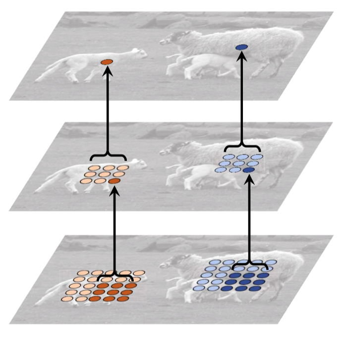

# Deformable Convolution

일반적인 convolution 연산은 receptive field가 필터 크기만큼 고정된 직사각형(대부분 정사각형) 형태가 된다. 또한, 이미지의 모든 부분을 이용하여 연산을 하게 된다. 하지만, 우리가 하고자 하는 task(예: 분류, 객체탐지)에서, 실제로 관심이 있는 영역은 이미지에서 일부 영역인 경우가 많다. 이때, 우리가 관심있는 영역만 연산 대상으로 하고 싶을때 사용할 수 있는 기법 중 하나가 deformable convolution이다. 본 문서에서는 deformable convolution이 무엇인지 설명하고, 어떠한 연구들이 있는지 살펴본다.

# Motivations

일반적인 convolution 연산은 다음과 같이 이루어지며, 고정된 크기, 모양의 receptive field를 가지게 된다.

Dai, Jifeng et al. “Deformable Convolutional Networks.”

이에 따른 convolution network에서의 아쉬운점(단점이라고 하기엔 좀 그렇고)은 다음과 같다.

1. 실제 연산이 이루어지는 convolution 연산의 범위는 이미지 전체이다. 하지만, 우리가 관심있는 영역은 이미지 전체 중 일부인 경우가 많다.

2. Convolution 네트워크가 왠만큼 깊지 않은 경우, 다음 그림처럼 receptive field가 직사각형 또는 정사각형으로 정해진 영역만 보는 경우가 많다.

   

   Zhu, Xizhou et al. “Deformable ConvNets V2: More Deformable, Better Results.”

이러한 convolution 연산의 아쉬운 점을 완화하기 위해 다음과 같은 convolution module이 등장하기도 했다.

- Spatial transformer [4]
- Dilated convolution (Atrous convolution) [6]

이 연구들은 모두 convolution 연산의 receptive field를 좀 더 유연하게 가져가려고 했는데, deformable convolution은 이러한 연구들보다 좀 더 일반화된 convolution 연산을 제안한다.

# Spatial Transformers

Spatial transformer는 convolution이 이미지의 관심없는 영역까지 모두 본다는 아쉬운 점을 지적한 논문 중 가장 주목받은 연구라고 볼 수 있다. spatial transformer에서는 하나의 convolution layer를 대체할 수 있는 spatial transformer block을 제안하며, 아이디어는 다음 그림으로 요약할 수 있다.

Jaderberg, Max et al. “Spatial Transformer Networks.”

$U, V$는 이미지가 아니라, convolution 중간 계층에서의 feature map이라고 보면 된다(편의상 이미지로 표현했다고 봐도 좋음). 이미지의 모든 영역을 다 사용하는 게 아니라, 다음과 같은 과정을 거쳐서 필요한 영역만 잘라온 후, convolution을 적용한다. 이때, 영역은 직사각형 모양으로 형성된다. 이러한 과정은 이미지 픽셀 공간에서 이뤄질 수도 있지만, feature map 공간에서도 이루어질 수 있다.

이때, 영역을 잘라오는 과정은 affine grid sampling으로 이루어지는데, 다음과 같은 과정을 거치면서 이전 feature map의 영역을 잘라온다.

1. 입력 feature map의 spatial dimension이 $H \times W$라고 했을 때, $H \times W$ 크기의 affine grid $G$를 생성한다. 이때, affine grid는 일종의 빈 도화지라고 생각하면 된다. 위 그림에서 $V$인데, 아직 “9”가 그려지지 않은 상태라고 보면 된다.
2. 도화지(Grid) $G$를 어떠한 affine parameter $\theta$를 이용하여 affine transform을 적용한다. 위 그림에서는, $V$ 도화지에 affine transform을 적용했더니 $U$에서의 초록색 영역이 이루는 사각형이 얻어진 것을 보여준다.
3. $U$에서의 초록색 영역을 그대로 $V$로 뽑아온다.

그렇다면 feature map에서, 어느 영역을 잘라올지를 결정하는 affine parameter $\theta$를 계산해야 하는데, 이 affine parameter는 학습된 네트워크를 통해 계산된다. Spatial transformer block은 다음과 같은 모양으로 구성된다.

Jaderberg, Max et al. “Spatial Transformer Networks.”

Feature map $U$가 있을 때, $U$를 입력으로 받아서 작은 네트워크가 affine parameter $\theta$를 계산하게 되고, 이 파라미터를 이용하여 grid sampling을 수행하게 된다.

Spatial transformer는 분명, 관심있는 영역만 학습하는 데 유리하지만, affine transform에 한정된다는 아쉬운 점이 존재한다.

# Dilated Convolution

Convolution의 필터를 이미지에 적용할때, 필터 값 하나하나 사이에 공간을 주면서 계산하는 기법이다. 같은 수의 계층의 CNN을 적용했을 때, 일반적인 convolution filter에 비해 receptive field가 매우 넓다는 장점이 존재한다.

](Deformable%20Convolution%200ca815afeb9441e6b057c3d659fb0a84/Untitled%204.png)

출처: [https://www.researchgate.net/figure/An-illustration-of-the-receptive-field-for-one-dilated-convolution-with-different_fig1_336002670](https://www.researchgate.net/figure/An-illustration-of-the-receptive-field-for-one-dilated-convolution-with-different_fig1_336002670)

# Deformable Convolution

Deformable convolution 역시 spatial transformer와 마찬가지로 이미지의 관심있는 영역만 연산하고자 하는 노력에서 나온 결과물이다. Spatial transformer는 관심있는 영역을 사각형 영역으로만 추출하지만, deformable convolution은 관심있는 영역을 어떠한 모양으로도 추출할 수 있다.

Grid sampling을 통해 receptive field를 이미지 일부로 제한하는 spatial transformer와 달리, deformable convolution은 kernel을 이미지에 내적해줄 때, kernel 모양 그대로 이미지와 내적해주는 게 아니라, kernel 적용 위치에 offset을 적용해준다.

Dai, Jifeng et al. “Deformable Convolutional Networks.”

일반적인 convolution에서, 3x3 커널을 이미지와 convolution 할 때, 이미지에서도 이웃한 3x3 픽셀 9개를 들고와서 커널과 내적해준다. 위 그림의 input feature map에서 초록색 정사각형 부분과 필터가 convolution된다. 반면, deformable convolution에서는 커널과 convolution할 이미지의 영역을 이웃한 3x3 정사각형 영역이 아니라, 약간의 offset을 주어서 convolution할 픽셀을 조정하게 된다.

이때, offset은 spatial transformer에서 affine parameter를 계산할 때와 마찬가지로 다른 네트워크에 의해 계산된다.

학습이 이루어짐에 따라, offset이 적절히 적용되어서 이미지의 관심있는 영역만 convolution 연산이 이루어지게 된다. 다음 이미지는 deformable convolution의 receptive field를 보여주는 그림이다.

Dai, Jifeng et al. “Deformable Convolutional Networks.”

다음은 deformable convolution을 처음 제안한 “Deformable Convolutional Networks”와 “Deformable ConvNets v2: More Deformable, Better Results”를 읽고 정리한 문서이다.

[Deformable Convolutional Networks](https://wayexists.notion.site/Deformable-Convolutional-Networks-72fc11852d4a4001b62e15af56c7d111)

[Deformable ConvNets v2: More Deformable, Better Results](https://wayexists.notion.site/Deformable-ConvNets-v2-More-Deformable-Better-Results-5bb88e616ff64f73a7e5037447688eb0)

# Application

Deformable convolution은 convolution 뿐 아니라 다양한 곳에 응용되고 있다. 다음은 deformable 연산을 이용한 연구들이다.

[Vision Transformer with Deformable Attention](https://wayexists.notion.site/Vision-Transformer-with-Deformable-Attention-68b039a052a848e398e5361f64f2e940)

# Reference

[1] Dai, Jifeng, Haozhi Qi, Yuwen Xiong, Yi Li, Guodong Zhang, Han Hu and Yichen Wei. “Deformable Convolutional Networks.” *2017 IEEE International Conference on Computer Vision (ICCV)* (2017): 764-773.

[2] Zhu, Xizhou, Han Hu, Stephen Lin and Jifeng Dai. “Deformable ConvNets V2: More Deformable, Better Results.” *2019 IEEE/CVF Conference on Computer Vision and Pattern Recognition (CVPR)* (2018): 9300-9308.

[3] Xia, Zhuofan, Xuran Pan, Shiji Song, Li Erran Li and Gao Huang. “Vision Transformer with Deformable Attention.” *2022 IEEE/CVF Conference on Computer Vision and Pattern Recognition (CVPR)* (2022): 4784-4793.

[4] Jaderberg, Max, Karen Simonyan, Andrew Zisserman and Koray Kavukcuoglu. “Spatial Transformer Networks.” *NIPS* (2015).

[5] Jeon, Yunho and Junmo Kim. “Active Convolution: Learning the Shape of Convolution for Image Classification.” *2017 IEEE Conference on Computer Vision and Pattern Recognition (CVPR)* (2017): 1846-1854.

[6] Holschneider, Matthias, Richard Kronland-Martinet, Jean Morlet and Philippe Tchamitchian. “A real-time algorithm for signal analysis with the help of the wavelet transform.” (1989).
